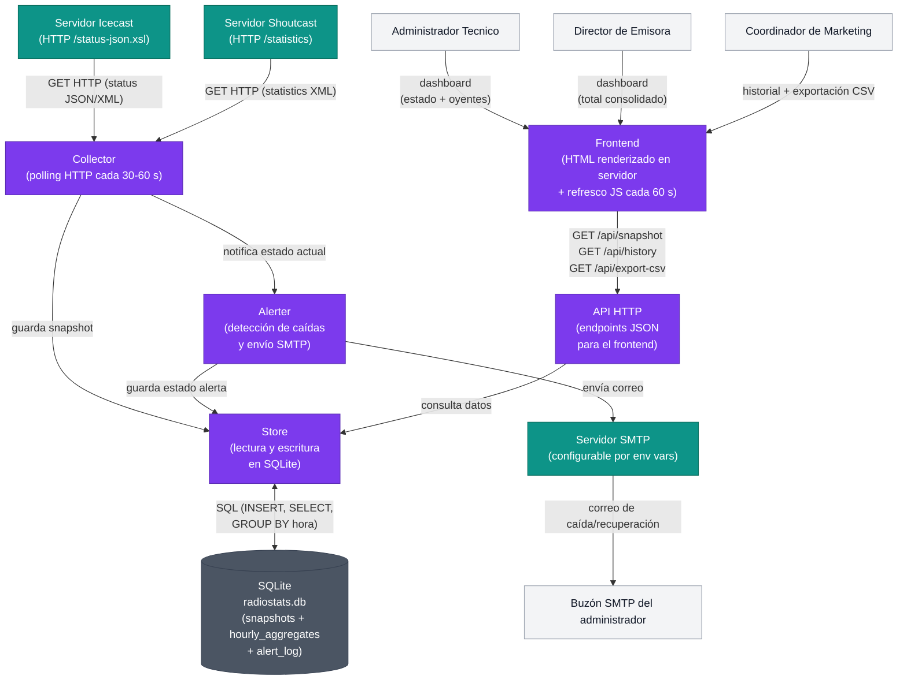

# Arquitectura del MVP — Radiostats

**Generado por:** Architect  
**Fecha:** 2026-06-30  
**Delivery:** radiostats

---

## Contexto del producto

Radiostats es un panel de monitoreo y análisis de audiencia para emisoras de radio
en streaming. Permite al Administrador Técnico, al Director de Emisora y al
Coordinador de Marketing ver el estado y los oyentes de todos sus servidores
Icecast/Shoutcast en una sola vista, recibir alertas automáticas de caídas y
exportar reportes de audiencia sin trabajo manual.

---

## Diagrama de componentes

---

## Descripción de componentes

### Collector

**Responsabilidad:** ejecutar el ciclo de polling periódico contra los endpoints HTTP
de cada servidor Icecast o Shoutcast configurado. Extrae el número de oyentes y el
estado (activo / no responde) y pasa el resultado al Store y al Alerter.

**Por qué existe:** `req:R-02` obliga a consultar automáticamente los servidores a
intervalos regulares. `req:R-08` exige datos directos de los servidores, sin terceros.
`req:R-09` requiere operación continua 24/7. El intervalo de 30 s garantiza la
detección en ≤5 minutos (`mvp:metrica-exito-deteccion-5min`).

**Decisión de diseño:** ADR-0002.

---

### Store

**Responsabilidad:** encapsular toda la lógica de lectura y escritura sobre la base
de datos SQLite. Expone métodos para: insertar un snapshot, consultar el historial
por rango de fechas y granularidad horaria, obtener el estado actual de cada servidor,
y registrar eventos de alerta.

**Por qué existe:** centralizar el acceso a datos evita que Collector, Alerter y API
acoplen directamente sus consultas SQL. Facilita un posible cambio de motor de base
de datos sin tocar los módulos que lo usan.

**Decisión de diseño:** ADR-0003.

---

### Alerter

**Responsabilidad:** comparar el estado actual de cada servidor con el último estado
registrado. Si detecta una transición `activo → no_responde` o `no_responde → activo`,
compone el correo correspondiente y lo envía via SMTP. Persiste el estado de la
alerta enviada para evitar duplicados tras un reinicio.

**Por qué existe:** `req:R-03` obliga a emitir alertas automáticas sin intervención
humana. `us:US-03` define la latencia máxima de ≤5 minutos y los dos eventos que
deben notificarse (caída y recuperación). El canal es SMTP por supuesto:OQ-01.

**Decisión de diseño:** ADR-0004.

---

### API HTTP

**Responsabilidad:** exponer endpoints HTTP JSON al Frontend. Endpoints mínimos del
MVP:
- `GET /api/snapshot` — estado y oyentes actuales de todos los servidores.
- `GET /api/history?from=&to=&granularity=hour` — historial de audiencia por rango.
- `GET /api/export-csv?from=&to=` — genera y descarga el archivo CSV.

**Por qué existe:** desacopla el Frontend del Store; permite que el refresco automático
del dashboard (US-01, criterio de aceptación de 60 s) funcione con una petición
parcial en lugar de recargar la página completa.

---

### Frontend

**Responsabilidad:** servir las vistas HTML al navegador. El dashboard principal
incluye un fragmento de JavaScript que solicita `/api/snapshot` cada 60 segundos y
actualiza los valores en el DOM. La vista de historial (US-04) renderiza un gráfico
usando Chart.js con los datos de `/api/history`. La exportación CSV (US-05) es un
enlace que dispara la descarga desde `/api/export-csv`.

**Por qué existe:** `us:US-01` exige refresco automático cada 60 s sin recargar la
página. `us:US-04` exige visualización gráfica del historial horario. El Frontend
se sirve desde el mismo proceso del monolito, sin infraestructura separada (ADR-0001).

**Decisión de diseño:** ADR-0005.

---

### SQLite (radiostats.db)

**Responsabilidad:** almacenamiento persistente del historial de 90 días. Tablas
principales:
- `snapshots(id, server_id, timestamp_utc, listeners, status)` — datos crudos de
  cada ciclo de polling.
- `hourly_aggregates(server_id, hour_utc, avg_listeners, max_listeners)` — agregados
  precalculados que alimentan US-04 y US-05.
- `alert_log(id, server_id, event_type, sent_at, notified)` — registro de alertas
  enviadas para evitar duplicados.

**Por qué existe:** `req:R-02` obliga a guardar historial con marca de tiempo.
`supuesto:OQ-05` fija la retención en 90 días. ADR-0003 justifica la elección de
SQLite sobre PostgreSQL o bases de datos de series temporales.

---

## Decisiones adoptadas (ADRs)

| ADR | Decisión | Resumen |
|-----|----------|---------|
| ADR-0001 | Monolito modular | Una sola aplicación desplegable con módulos internos. Justificado por el alcance de 1–10 servidores y la ausencia de requisito multi-tenant en el MVP. |
| ADR-0002 | Polling HTTP periódico | El Collector consulta los endpoints HTTP estándar de Icecast/Shoutcast cada 30–60 s. Compatible con la infraestructura existente sin modificaciones. |
| ADR-0003 | SQLite con agregados horarios | Base de datos local sin servidor; volumen del MVP (decenas de miles de filas) no justifica PostgreSQL ni InfluxDB. |
| ADR-0004 | Alertas via SMTP integrado | El Alerter detecta transiciones de estado en cada ciclo de polling y envía correo SMTP sin dependencias externas en el camino crítico. |
| ADR-0005 | Frontend SSR + polling JS a 60 s | HTML renderizado en servidor con fetch periódico para actualizar contadores. Sin SPA ni WebSocket: nivel de interactividad del MVP no lo requiere. |

---

## Decisiones pendientes / open questions

Las siguientes decisiones **no se toman en este ADR** porque las fuerzas del
discovery no las obligan en el MVP, o porque dependen de una elección de
implementación (lenguaje/framework) que pertenece al equipo de desarrollo, no a
la planificación de arquitectura.

| ID | Pregunta abierta | Por qué no se decide ahora |
|----|-----------------|---------------------------|
| OQ-ARCH-01 | ¿Qué lenguaje de programación implementa el monolito? (Python, Go, Node.js, etc.) | No hay restricción en el discovery. Es una decisión del equipo de desarrollo, condicionada por el stack existente de la emisora. Se resuelve en el spike de iteración 0. |
| OQ-ARCH-02 | ¿Cómo se despliega el monolito? (Docker, proceso systemd, VPS, PaaS) | El discovery no especifica infraestructura de hosting. Se decide junto con el cliente antes del primer despliegue. |
| OQ-ARCH-03 | ¿Multi-tenancy? ¿SaaS para varias emisoras? | Explícitamente fuera de alcance del MVP (`mvp:fuera-de-alcance`). Si se adopta, requerirá revisar ADR-0001 y ADR-0003 (SQLite → PostgreSQL con schemas separados o row-level security). |
| OQ-ARCH-04 | ¿Canales de alerta adicionales (Slack, SMS, webhook)? | Solo SMTP está acordado (supuesto:OQ-01). Cualquier canal adicional requiere un nuevo ADR cuando el cliente lo solicite formalmente. |
| OQ-ARCH-05 | ¿Autenticación de usuarios en el frontend? | El discovery no incluye gestión de usuarios (`mvp:fuera-de-alcance`). Si el sistema se expone a internet, se requiere al menos autenticación HTTP básica antes del lanzamiento. Debe resolverse antes del despliegue en producción. |
| OQ-ARCH-06 | ¿Exportación en PDF? | El MVP genera solo CSV (supuesto:OQ-04). PDF es post-MVP explícito. |

---

## Lo que queda explícitamente fuera del MVP

Coherente con `mvp:fuera-de-alcance`:

- Segmentación de audiencia por programa o franja horaria (R-05).
- Gestión de usuarios y roles de acceso diferenciado.
- Integración con plataformas de publicidad externas o CRM.
- Análisis predictivo o alertas de tendencia.
- Exportación en PDF.
- Canales de alerta distintos de correo electrónico (Slack, SMS, webhook).
- Multi-tenancy (varias emisoras en una sola instancia).
- Importación de historial previo al inicio del MVP.
