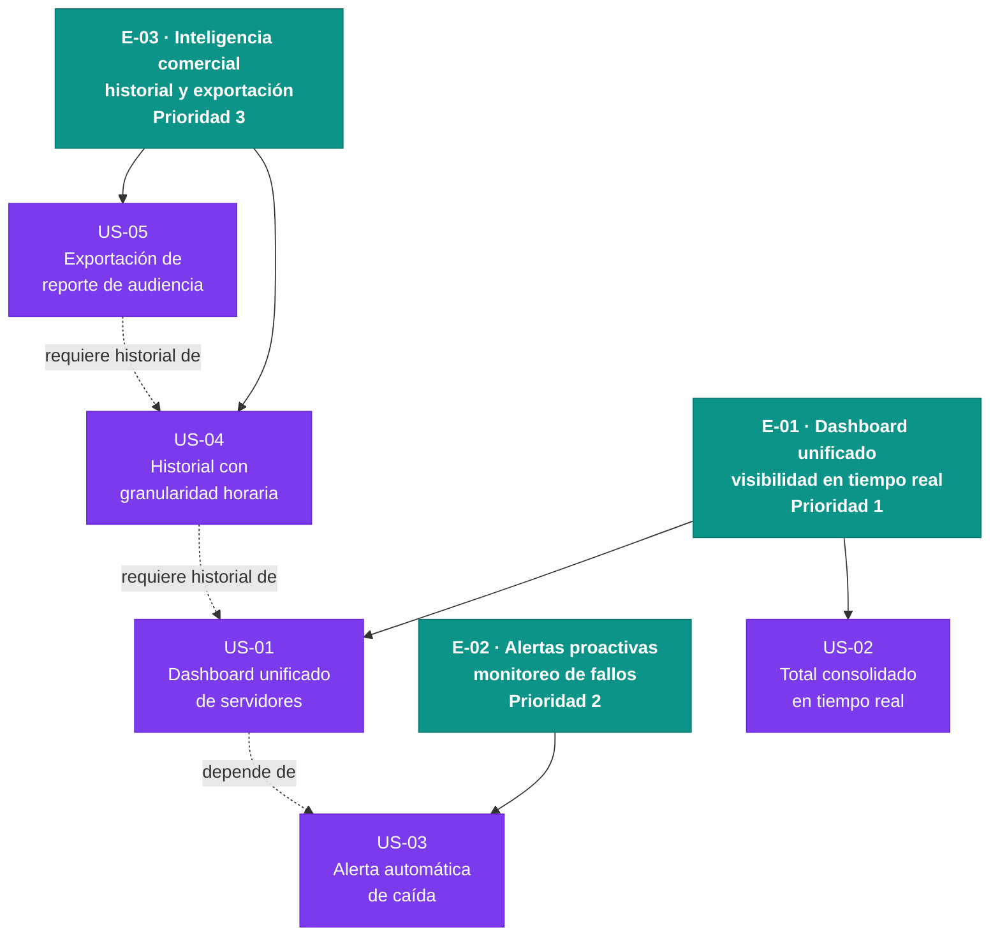

# Épicas — Radiostats

Fecha de generación: 2026-06-30
Rol responsable: Product Owner

---

## E-01 · Dashboard unificado: visibilidad operativa en tiempo real

**Valor (outcome):** El Administrador Técnico y el Director de Emisora dejan de abrir una pestaña por servidor y pasan a tener el estado completo y el total de oyentes en una sola pantalla actualizada en menos de 60 segundos; elimina el comportamiento de revisión manual panel por panel.

**Origen:**
- `mvp:funcionalidades-minimas` — ítem 1 (US-01) e ítem 2 (US-02)
- `mvp:propuesta-de-valor` — "panel unificado … sin navegar entre múltiples interfaces"
- `mvp:supuestos-riesgosos` — supuesto 1: APIs de Icecast/Shoutcast accesibles (riesgo técnico alto; debe validarse en esta épica antes de construir las demás)
- Requisitos: R-01, R-07, R-08
- Dolores: `monitoreo-multi-panel`, `vista-consolidada-inexistente`

**Prioridad:** 1
**Justificación de prioridad:** Es la base técnica del MVP y valida el supuesto más riesgoso (acceso a las APIs); sin esta épica completada ninguna otra puede entregar valor. Concentra los dolores de las dos personas de mayor influencia en la adopción inicial.

**Historias:** US-01, US-02

---

## E-02 · Monitoreo proactivo: alertas automáticas de fallos de servidor

**Valor (outcome):** El Administrador Técnico recibe notificación de caída en menos de 5 minutos sin intervención humana, pasando de detectar fallos de forma reactiva (cuando un oyente llama) a detectarlos de forma proactiva; cumple directamente la métrica de éxito primaria del MVP.

**Origen:**
- `mvp:funcionalidades-minimas` — ítem 3 (US-03)
- `mvp:resultado-esperado` — "El Administrador Técnico detecta fallos de servidor en menos de 5 minutos"
- `mvp:metrica-de-exito` — "Tiempo medio desde la caída hasta la notificación ≤ 5 min"
- Requisitos: R-03, R-09
- Dolor: `deteccion-reactiva-fallos`

**Prioridad:** 2
**Justificación de prioridad:** Contiene la métrica de éxito más concreta del MVP (≤5 min de detección); es el argumento operativo más fuerte para la adopción por parte del Administrador Técnico, quien es el usuario más frecuente del sistema.

**Historias:** US-03

---

## E-03 · Inteligencia comercial: historial y exportación de reportes de audiencia

**Valor (outcome):** El Coordinador de Marketing pasa de depender de encuestas externas (datos con 1-2 años de rezago) a consultar datos propios con granularidad horaria y exportar reportes listos para anunciantes en minutos sin trabajo manual; cumple la segunda métrica de éxito del MVP.

**Origen:**
- `mvp:funcionalidades-minimas` — ítems 4 (US-04) y 5 (US-05)
- `mvp:resultado-esperado` — "El Coordinador de Marketing genera reportes para clientes en minutos, sin construirlos manualmente"
- `mvp:metrica-de-exito` — "Al menos un reporte exportado por el coordinador en el primer mes, sin trabajo manual adicional"
- Requisitos: R-02, R-04, R-06
- Dolores: `datos-audiencia-desactualizados`, `datos-llegan-tarde`, `reportes-manuales-clientes`, `perdida-oportunidades-comerciales`

**Prioridad:** 3
**Justificación de prioridad:** Depende de que E-01 ya esté recolectando datos (necesita historial acumulado para ser útil). Es la épica que cierra el argumento comercial ante anunciantes y habilita la segunda métrica de éxito, pero no puede demostrar valor hasta que exista al menos una semana de datos históricos.

**Historias:** US-04, US-05

---

## Preguntas abiertas (open questions)

Las siguientes incertidumbres no están respaldadas por el discovery actual y no deben asumirse como hechos:

1. **Canal de alerta (US-03):** El discovery menciona "correo o mensaje" pero no especifica si se usará correo electrónico, SMS, Slack u otro canal. Debe confirmarse con el Administrador Técnico antes de refinar US-03.

2. **Autenticación de las APIs:** El discovery asume que las APIs de Icecast/Shoutcast son accesibles, pero no documenta si requieren credenciales por servidor, configuración especial o ajuste de CORS. Debe validarse en un spike técnico antes de comprometer el sprint de E-01.

3. **Número de servidores configurados:** El discovery no indica cuántos servidores gestionará la emisora en el MVP (¿2? ¿10? ¿50?). Afecta las decisiones de diseño del dashboard y la carga de polling.

4. **Formato de exportación prioritario (US-05):** El discovery menciona "PDF o CSV" sin priorizar. Debe confirmarse cuál formato esperan los anunciantes antes de estimar esta historia.

5. **Adopción del coordinador de marketing:** El discovery identifica este riesgo explícitamente (supuesto 2 del canvas). No hay evidencia de que el coordinador ya haya aceptado cambiar su flujo de trabajo. Requiere validación durante o antes del lanzamiento de E-03.

---

## Diagrama Mermaid del backlog

**Leyenda:**
- Teal (verde-azul): épicas
- Morado: historias candidatas que requieren refinamiento por el Developer
- Verde: historias listas (ninguna en este estado aún — pendiente de gate DoR/INVEST)
